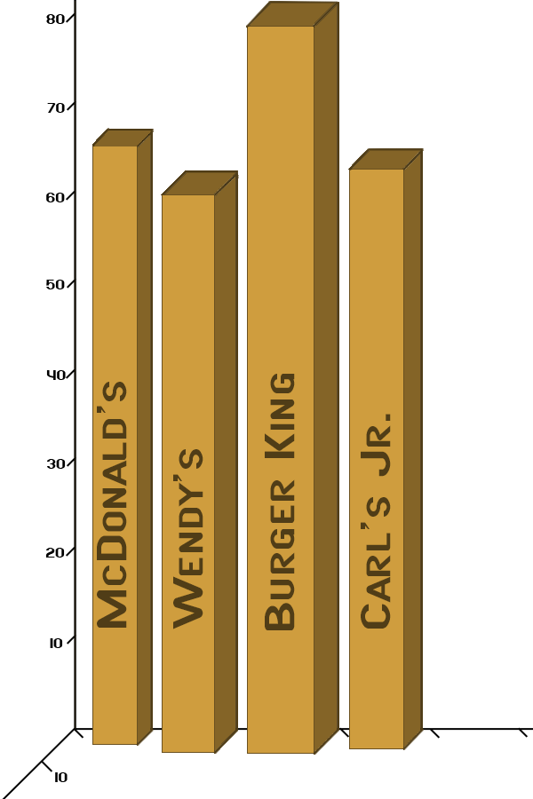

```{r setup, include=FALSE}
knitr::opts_chunk$set(echo = TRUE)
library(tidyverse)
fries <- read.csv("fries.csv")
```

## Introduction

Originating in Belgium or France in the late 1600’s, the french-fry has been around longer than the United States. While the origination is disputed, our research team is interested in the modern-day french-fry. The french-fry’s long history has created the opportunity for a large number of variants: The waffle fry, the steak fry, the curly fry, etc. To limit the scope of our research we set our sights on the traditional, standard cut fry. The standard cut fry is evenly cut, medium-thin, and only fried once.

We want to know how different American fast-food chains fries compare. Using properties like weight, width, length, height, and cost, we can get each brands mean fry. Then compare different companies mean fry to find the best value fry. While subjective, the best value fry has the lowest cost per fry density. In more simple terms, we are asking “Which American fast-food company gives the most fry per dollar?”


## Methodology and Data Collection


We decided to compare 4 major American fast-food companies: McDonalds, Carl’s Jr., Burger King, and Wendy’s. Our process involved ordering a large fry then measuring the weight, length, width, and height of each fry.  The population we are studying is the "average fry" from each of these restaurants in the Millcreek, UT area (NOT the "average french fry order").Due to budgetary constraints, a single order of large fries was procured from each location. While it would have been nice to discuss "which Restaurant has the best order of fries?", this would have required a very large time and money investment to get a good sample.

Unfortunately, our sample is a "convenience sample". Our team discussed what it would take to do a "simple random sample" of french fries from these restaurants, and it just didn't seem feasible from a cost or time perspective. We spent around $15 on fries, and it took us around 4 hours to measure and gather our data. Getting a good "simple random sample" would easily require 10 times the money and time. This revealed to us that getting a good sample of data is difficult.

We encountered two issues when measuring the fries; the first we will call "crumb corruption". In order to measure the fries, we had to handle them. In doing so, small bits of crumbs would occasionally fall off of the french fry. This may have a slight impact on the weight of each fry. This is hardly unique to our study, as most measuring devices must affect the thing they are measuring to get a reading. For example, a voltmeter must affect the circuit it is hooked up to in order to get a measurement.

The second issue is what we call "crumb arbitrariness". We tried to measure each fry, no matter how small. However, we did not measure what we deemed as"crumbs". But isn't a crumb just a small french fry? This was a judgement call that we made when measuring the data, but we didn't have a concrete rule for what is considered a "fry" or a "crumb".

Fries were collected during the last week of March 2022. A researcher would place the fry on a scale and read the weight visible on the scale. The scale is an Ozeri ZK14-S Pronto digital kitchen and food scale. The scale is accurate from 0 to 5100 grams. The scale has a precision to 1 gram (0.04 oz). A second researcher would input the data into a .csv file.


The researcher will then take the fry and measure it's length. The measurement device is a stainless steel millimeter/inch ruler that is 6 inches long. If the fry is curved the researcher would extend the fry until straight. The researcher would then measure the center of the fry by the height and width and state the two numbers. As before, a second researcher would input those values into the .csv file. A single fry was longer than the measuring tape. This specific fry was measured to the entire length then shifted to measure the remaining length. Each fry was placed directly on the measuring ruler then visually measured.


The weight and cost of each large fry can be seen below:

- McDonald's Large Fries
  - 6.53oz/185g
  - $3.68 (with tax)
	
- Wendy's Large Fries
  - 6.35oz/180g
  - $3.13 (with tax)

- Burger King Large Fries
  - 6.42oz/182g
  - $3.55 (with tax)

- Carl's Jr. Large Fries
	- 5.33oz/151
	- $3.22 (with tax)

	
	
Measuring each fry from the four companies provided data from over 300 fries and over 1200 data points. Weights were collected in ounces, the ounces were converted to grams due to the scale's accuracy. Due to measurement limitations the weights and dimensions are discrete variables though weight and length are in actuality continuous variables. While measuring the scale would occasionally oscillate between two weight values; example of 1 and 2 ounces. While weight could normally be a continuous variable, due to the scale limitations, weight will be treated as discrete measurements in terms of grams. 

Evaluating the data will consist of visualizing each company’s measured large fry population values to find possible trends. Then we will get statistical data to evaluate what the average fry is for each company. This includes measured data like weight and calculated values like density or other meaningful statistical values.  Using the values of an average fry we will then use a confidence interval to see the bounds on our experiment and validate each average fry. Once this has been done for each company, we can then compare the average fry between companies. Assuming the data the we collected is somewhat normally distributed, we will use a t test with a 95% confidence interval to compare the restaurant's fries.

## Data Analysis
```{r, echo=FALSE}
##start with adding density so all subsets have density
fries$Density = fries$Grams /(fries$Length * fries$Width * fries$Height)

##All that fancy stats stuff
##If you want to get data from just one place do something like 
##`r 
justWendys <- subset(fries, Business== "Wendys")
justbk <- subset(fries, Business== "BurgerKing")
justmcd <- subset(fries, Business== "McDonalds")
justcarl <- subset(fries, Business== "CarlsJr")
```

In data analysis we will provide averages, volume, dimensions, weight accuracy and mass calculations.


**Average Fry Statistics**

We composed the following two tables. The first one shows the overall statistics of the large fry order. These are not great referernce points because we only got one large from each company. However, we can get some of the picture from the first table. The second table is more interesting because it shows the average fry from each company and will be the basis of most of our analysis. 

```{r, echo=FALSE, warning=FALSE}

avgfrystats <- data.frame(Company  = c("McDonalds", "Wendy's", "Burger King", "Carl's Jr."),
                            Grams = c(mean(justmcd$Grams),mean(justWendys$Grams),mean(justbk$Grams),mean(justcarl$Grams)),
                            Length = c(mean(justmcd$Length),mean(justWendys$Length),mean(justbk$Length),mean(justcarl$Length)),
                            Height = c(mean(justmcd$Height),mean(justWendys$Height),mean(justbk$Height),mean(justcarl$Height)),
                            Width = c(mean(justmcd$Width),mean(justWendys$Width),mean(justbk$Width),mean(justcarl$Width)),
                            Density = c(mean(justmcd$Density),mean(justWendys$Density),mean(justbk$Density),mean(justcarl$Density))
                           )
knitr::kable(avgfrystats, caption = "The Average Fry Dimensions")

```


```{r, echo=FALSE, warning=FALSE}

AverageStats <- data.frame (Company  = c("McDonalds", "Wendy's", "Burger King", "Carl's Jr."),
                            FryCount = c(95,93,48,82),
                            CostPerFry = (c(3.68, 3.13, 3.55, 3.22)),
                            CostPerGram   = c(3.68/185,3.13/180,3.55/182,3.22/151)
                           )

AverageStats$CostPerFry <- AverageStats$CostPerFry/AverageStats$FryCount
knitr::kable(AverageStats, caption = "Large Fries: Fry Count, Cost, Price Per Gram, and Price per Fry")
```


These values are the average measured results, as well as a calculation for density. However, there is a flaw that likely comes into account from the way we collected the data. We assumed Height and width should be approximately the same because each fry should be a square. This is true for all values except Wendy’s. Wendys has about a millimeter and a half of difference between the height and the width of the fry. If we were doing this study again, it would make sense to make height the larger dimension to avoid this issue again of a non-square fry. 

Looking at the stats above shows that all the fries are fairly similar accept Burger King. Burger king has fries over two times the weight, and over 10 mm longer. They also appear to be thicker. However, they are less dense than McDonalds. Wendys appears to have the least dense fries, with Carls Jr. coming in third. Wendy’s fries are just over half as dense as McDonalds. 

Nevertheless, the value we care most about is density. Density should not be affected by the width and height components, because they are both treated as equals. We believe that density is better because it balances the size and weight of each fry. It allows us to look at a comparison of the fries that are long and skinny as equally as the fries that are thick and short. To get a good picture of density, we will first evaluate volume, then mass. 

See below for the average dimensions of fries between the companies. 




**Volume**

We wanted to graph each of the measured results as well as volume. We were curious if the individual measurements would give us insight along with the combined volume. We Graphed the length, width, and height, then multiplied them to get the volume. We graphed them all with similar code to what follows:

```{r, echo=TRUE}
ggplot(fries) +
  geom_density(aes(x=Length, fill=Business), alpha=0.5) +
  labs(
    title="Length of Fries",
    x="Length (mm)"
  ) +
  theme_gray()
##t.test(justbk$Length,justmcd$Length,conf.level=0.95)
```

```{r, echo=FALSE, warning=FALSE}

ggplot(fries) +
  geom_density(aes(x=Height, fill=Business), alpha=0.5, adjust=1.9) +
  labs(
    title="Height of Fries",
    x="Height (mm)"
  ) +
  theme_gray()
```

```{r, echo=FALSE, warning=FALSE}

ggplot(fries) +
  geom_density(aes(x=Width, fill=Business), alpha=0.5, adjust=1.9) +
  labs(
    title="Width of Fries",
    x="Width (mm)"
  ) +
  theme_gray()
```

```{r, echo=FALSE, warning=FALSE}
ggplot(fries) +
  geom_density(aes(x=Length*Width*Height, fill=Business), alpha=0.5, adjust=1.9) +
  labs(
    title="Volume of Fries",
    x="Volume (mm^3)"
  ) +
  theme_gray()
##t.test(justbk$Length*justbk$Width*justbk$Height,justWendys$Length*justWendys$Width*justWendys$Height,conf.level=0.95)
```

Immediately, when looking at these four graphs, you can see how accurate McDonalds slices their fries. Both the height and the width of nearly every fry is 5mm. McDonalds definitely has the most consistency when it comes to the way the cut their fries.   Looking at all four graphs and the statistics from earlier, it is clear that burger king has a different fry then the other brands. Burger king has longer and thicker fries then the other companies. 

**Weight and Accuracy**

As a sanity check, we measured the weight of all the fries individually as well as the fries as a whole. The following table shows the comparison:


```{r, echo = FALSE}
WWeight <- sum(justWendys$Grams)
BWeight <- sum(justbk$Grams)
MWeight <- sum(justmcd$Grams)
CWeight <- sum(justcarl$Grams)

weightsSum <- (matrix(c("Location", "Combined Weight", "Individual Sums", 
                        "Wendy's", 180, WWeight, 
                        "Burger King", 182, BWeight, 
                        "McDonalds", 185, MWeight, 
                        "Carl's Jr", 151, CWeight)
                      ,3))
weightSumMatrix <- (matrix(c(180,  182, 185, 151, WWeight, BWeight,  MWeight,  CWeight), 4))

deviationWeights <- (abs(180 - WWeight) + abs(182 - BWeight) + abs(185 - MWeight) + abs(151 - CWeight))/4

echo = TRUE

knitr::kable(weightsSum, caption = "Combined Weight vs. Individual Weights Summed")


```

The combined weight of the collective fries was different than the weight of all fries combined. 
Combining all values results in a standard deviation of `r deviationWeights` grams among all the fries. This indicates a standard deviation, or error of `r (deviationWeights)/nrow(fries)` grams per fry. While we believe the singular measured weight of all of the fries to be the most accurate, it doesn't allow us to get per fry statistics. We believe the error to be fairly large and means we would need to collect more samples for any values that contain weight. For the remainder of the data collected we will analyze the data assuming no weight measurement error.


We graphed the weight in a similar format as above:
```{r, echo=FALSE, warning=FALSE}

ggplot(fries) +
  geom_density(aes(x=Grams, fill=Business), alpha=0.5, adjust=1.9) +
  labs(
    title="Mass of Fries",
    x="Mass (grams)"
  ) +
  theme_gray()

#adjust 1.9 smoothes the discrete values into a normal looking graph.
t.test(justbk$Grams,justmcd$Grams,conf.level=0.95)
```

This picture is roughly the same. Burger King, as a very normal distribution with heavier, but fewer fries. McDonalds seems to have more fries of a higher mass than Wendy’s or Carls Jr. However, these three seem to have very similar masses. Looking at density will hopefully negate the gap in approach between Burger King and the other three brands. 

**Density**


```{r, echo=FALSE, warning=FALSE}

ggplot(fries) +
  geom_density(aes(x=Density, fill=Business), alpha=0.5, adjust=1.9) +
  labs(
    title="Density of Fries (M/V)",
    x="Density (g/mm^3)"
  ) +
  theme_gray()

#adjust 1.9 smoothes the discrete values into a normal looking graph.
t.test(justbk$Density,justmcd$Density,conf.level=0.95)
```

We have finally arrived to density. This graph is different from all the others because it puts mass in relation volume. Looking at the above graph shows that McDonalds has a denser fry on average. Burger king has the most consistent density in fry at second place. Wendy’s also has a fairly consistent fry. Carl’s Jr. has less consistency, but typically the same average density as the other fries. 


Performing a one-way analysis of means, we check to see if we have 95% confidence that the grams between the fries is normally distributed between the fries.
```{r, echo = FALSE}
oneway.test(Grams ~ Business,
            data = fries,
            var.equal = TRUE)

```

As p-value is well below 0.05 we reject the hypothesis that the grams are similar. This is interpreted to mean that grams vary between businesses.

## Study Limitations

As previously discussed, multiple limitations exist in this study. Limitations and recommendations for future studies are provided below.

 - Weight measurement: The kitchen scale used provided 1 gram accuracy. A measuring scale accurate to 0.1 gram would have provided improved information.
 - Dimension measurements: Dimensions were measured using a simple ruler and by eye. These were as accurate as researcher's vision allows. Though this provided millimeter accuracy, human requirements likely reduced accuracy. Future studies could use separate researchers measuring the same fry or electronic measurement tools.
 - Convenience Sample: The sample collected was a convenience sample. This leads the information of the average fry at a location and could be affected by a single employee. To improve accuracy in future studies, random times at multiple locations would provide samples that could be attributed to more universally.
 - Sample Size: The sample size was relatively small. Similar to convenience sample, a larger collection of fries over a longer period of time would provide a more universal and confident answer.

## Conclusions


